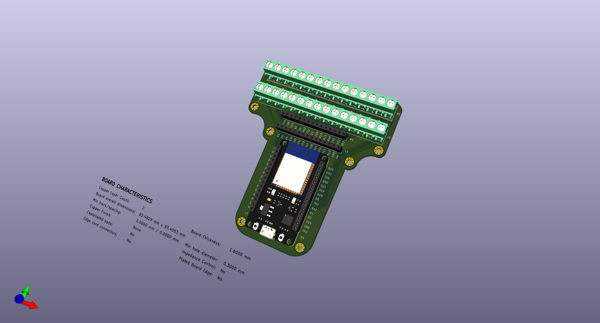

<h1>A Glove Keyboard</h1>

A keyboard without the board.  
(Work in Progress!)  

<h2></h2>

<h2>Introduction</h2>

This is a current project of mine that I'm finding to be fun, and have decided to share my PCB models and code as I go along. From a high-level, I'm making a pair of gloves which are individually paired with an ESP-32, accelerometers, bit-shift registers, etc. (you can find what I used in the final BOM - as this is for prototyping, and will be subject to change when looking to minimise processing delays.) 
Each finger is individually tracked, and when a finger taps a surface, the system analyzes its acceleration and position. It then runs through a dataset (using embedded ML) to determine what "key" would've hypothetically have been pressed based on the gesture within that moment.

I'll slowly be adding the boards, and prototyping boards I used, (and made - like the **example prototyping board below** designed to be attached just beneath the hand,) as well as the code. I'm trying to refine the design (sizing things down into compact PCB's) and make it faster currently, which has made for a fun learning experience!

<h2>Example Prototyping Board</h2>
  
(This is for testing - the final revisions will be far smaller (I'm likely to change up the ESP!)
